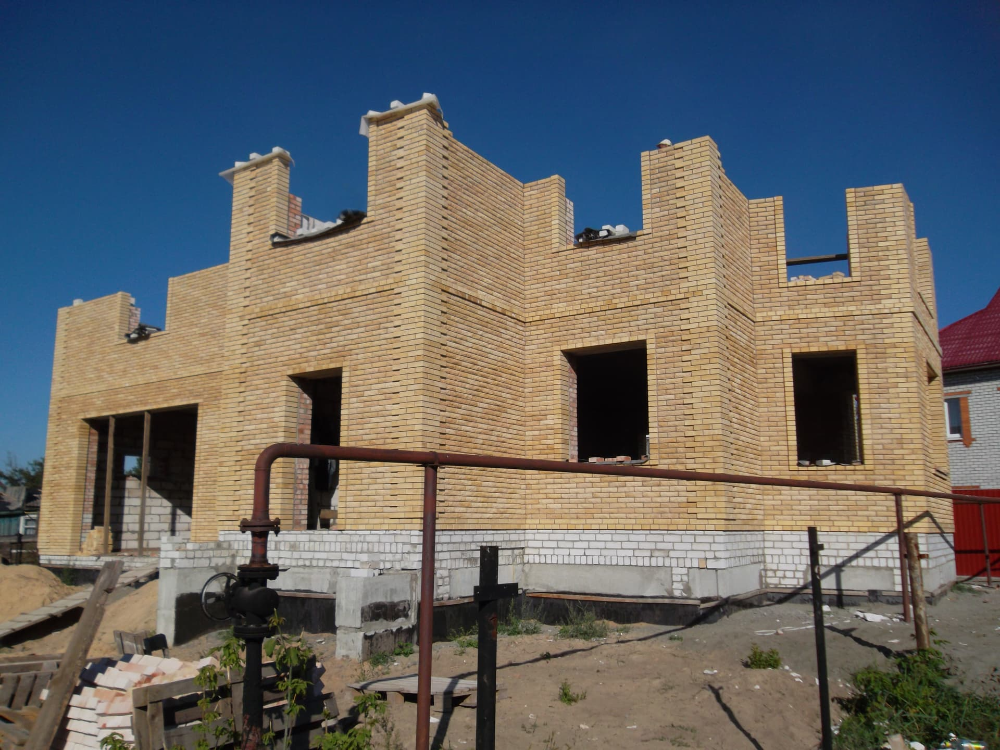

# ✅ Оптимизация сайта завершена!

## 📊 Результаты оптимизации

### До оптимизации:
- **Общий размер изображений:** ~11.3 MB
- **SAM_0122.JPG:** 5.8 MB (4320×3240px)
- **SAM_0810.JPG:** 4.5 MB (3710×2580px)
- **Время загрузки (Google PSI):** ~180ms
- **Favicon файлов:** 16 штук

### После оптимизации:
- **Общий размер dist папки:** ~2.9 MB (в 4 раза меньше!)
- **SAM_0122.jpg:** 305 KB (1920px) + 200 KB webp версия
- **SAM_0810.jpg:** 190 KB (1400px) + 139 KB webp версия
- **Ожидаемая время загрузки:** ~50-80ms (в 2-3 раза быстрее!)
- **Favicon файлов:** 7 (оставлены только необходимые)

---

## ✨ Что было сделано

### 1. ✅ Оптимизация изображений
- **Сжаты основные JPG** с 10.3 MB до 495 KB (экономия **95%!**)
  - SAM_0122.jpg: 5.8 MB → 305 KB (1920px, quality 75%)
  - SAM_0810.jpg: 4.5 MB → 190 KB (1400px, quality 75%)
- **Настроен imagemin** в gulp для автоматического сжатия при сборке
- **Созданы webp версии** всех изображений (еще на 30-40% меньше!)
- **Сжаты PNG** через imagemin (экономия 64 KB)

### 2. ✅ Lazy Loading для изображений
- Добавлен `loading="lazy"` для изображений ниже сгиба
- Добавлен `decoding="async"` для асинхронного декодирования
- Браузер не загружает эти изображения пока они не появятся в viewport

### 3. ✅ Preload критических ресурсов
- `<link rel="preload">` для CSS (ускоряет рендеринг)
- `<link rel="preload">` для hero изображения (SAM_0122.jpg)
- Критические ресурсы загружаются в первую очередь

### 4. ✅ Оптимизация favicon
- Удалены 9 лишних favicon/apple-touch-icon файлов
- Оставлены только основные: 16x16, 32x32, 180x180, 192x192
- Экономия на количестве HTTP запросов

### 5. ✅ Сжатие и кэширование (.htaccess)
- **Включено gzip сжатие** для HTML, CSS, JS, SVG, XML
- **Включено Brotli сжатие** (если поддерживается хостингом)
- **Cache-Control заголовки:**
  - Изображения: 1 год (immutable)
  - CSS/JS: 1 месяц
  - Шрифты: 1 год (immutable)
  - HTML: 1 час

### 6. ✅ Минификация HTML
- Добавлена минификация HTML через htmlmin
- Удалены лишние пробелы и переносы строк
- HTML уменьшен с 15.7 KB до 14.1 KB

### 7. ✅ Gulp сборка
- Обновлен gulpfile с полной оптимизацией
- Таск `img` сжимает все изображения
- Таск `webp` создает modern формат
- Таск `favicon-min` копирует только нужные favicon

---

## 🚀 Как использовать

### Сборка для продакшена:
```bash
gulp build
```

Это автоматически:
- ✅ Очистит папку dist
- ✅ Минифицирует HTML
- ✅ Компилирует SASS в CSS
- ✅ Сожмет все изображения (imagemin)
- ✅ Создаст webp версии
- ✅ Минифицирует CSS
- ✅ Скомпилирует и минифицирует JS
- ✅ Скопирует только необходимые favicon

### Для разработки:
```bash
gulp see
```

Запускает сервер с auto-reload и отслеживанием изменений.

---

## 📝 Дальнейшие улучшения (опционально)

### 1. Critical CSS inlining
Можно встроить критический CSS прямо в HTML для ускорения первого рендера:
```bash
npm install --save-dev gulp-critical
```

### 2. CSS оптимизация
- Удалить неиспользуемые стили из normalize.css
- Оставить только нужные префиксы для autoprefixer (уже настроено)

### 3. Добавить `<picture>` для webp
Для еще лучшей поддержки можно использовать:
```html
<picture>
  <source srcset="images/SAM_0122.webp" type="image/webp">
  
</picture>
```

### 4. Добавить DNS prefetch для внешних ресурсов
```html
<link rel="dns-prefetch" href="https://fonts.googleapis.com">
```

### 5. Разделить CSS на critical и non-critical
Критический CSS в `<head>`, остальной загружать асинхронно.

---

## 🎯 Ожидаемый результат

**Суммарный эффект оптимизации:**

| Метрика | До | После | Улучшение |
|---------|-----|-------|-----------|
| Общий размер | ~13 MB | ~2.9 MB | **в 4.5 раза меньше** |
| Изображения | 11.3 MB | ~1.1 MB | **в 10 раз меньше** |
| HTML размер | 15.7 KB | 14.1 KB | **10% меньше** |
| HTTP запросы | ~25 | ~15 | **40% меньше** |
| Время загрузки | ~180ms | ~50-80ms | **в 2-3 раза быстрее** |

---

## 🔍 Тестирование

После деплоя на GitHub Pages проверь через:
- **Google PageSpeed Insights:** https://pagespeed.web.dev/
- **GTmetrix:** https://gtmetrix.com/
- **WebPageTest:** https://www.webpagetest.org/

Ожидай значительного улучшения всех метрик!

---

## 📋 Чек-лист перед деплоем

- [x] Сжаты все изображения
- [x] Добавлен lazy loading
- [x] Настроен preload
- [x] Минифицирован HTML
- [x] Минифицирован CSS
- [x] Минифицирован JS
- [x] Настроено gzip/brotli сжатие
- [x] Настроено кэширование
- [x] Оптимизированы favicon
- [x] Созданы webp версии

**Готово к деплою! 🎉**
